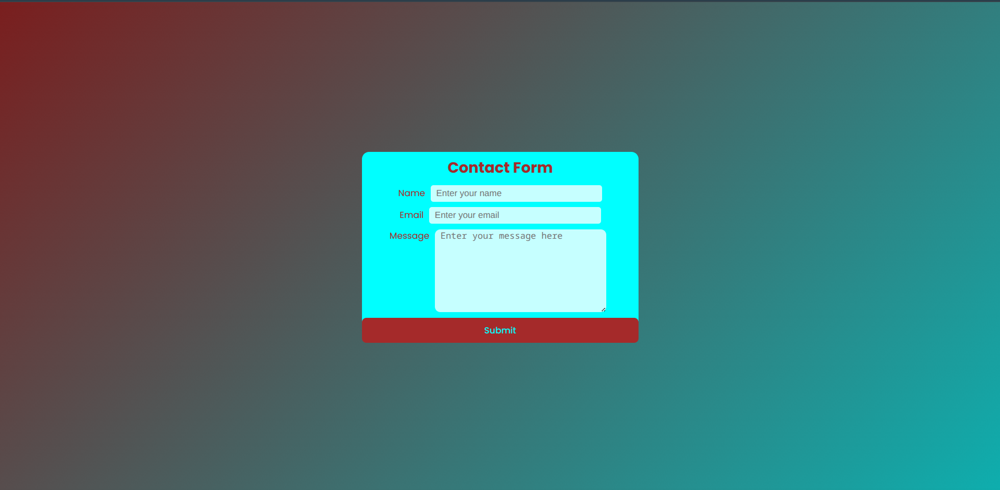
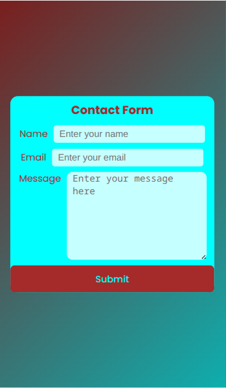

# Contact Form Project

## Description

This project is a **Contact Form** built with **React** and **TypeScript**, styled with plain **CSS**.  
It leverages **React Hook Form** for easy and effective form management and validation.

The form includes:

- Required field validation that shows error messages if inputs are empty.
- Email validation that detects invalid email formats and displays appropriate error messages.

As a junior developer, I’m proud of this project as it demonstrates my ability to build clean, accessible, and user-friendly forms using modern React practices.

---

## Technologies Used

- React
- TypeScript
- React Hook Form
- CSS

---

## Features

- Real-time validation feedback
- Clear and concise error messages
- Styled with custom CSS for a clean UI

---

---

## Screenshot

---

## How to Run

1. Clone the repository
2. Run `npm install` or `yarn` to install dependencies
3. Run `npm start` or `yarn start` to launch the app locally

---

## Future Improvements

- Add more input fields (phone, message, etc.)
- Connect the form to a backend API for submitting contact requests
- Enhance accessibility features

---

## Author

Junior Developer passionate about React and modern web development.

---
